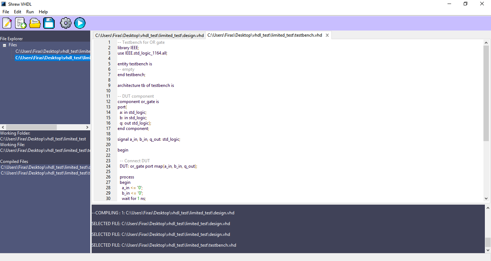
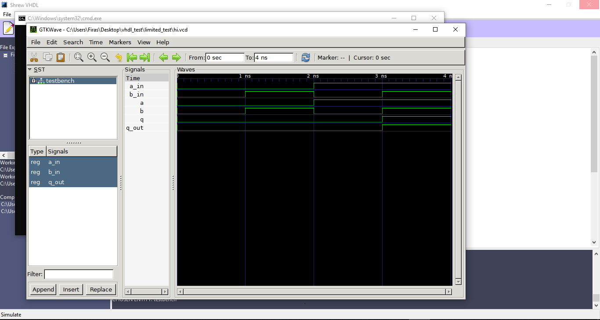

# Shrew-VHDL
the Alpha version of **Shrew VHDL**: A free open-source **VHDL IDE** for **Windows** (for now). I've been working on this project for the past couple of months and I'm happy that it is starting to take shape.

Equipped with the **GHDL compiler** and **GTKWave wave viewer**, the software is fully **stand-alone**, it does not require any installation, everything it needs (libraries, GUI framework, third party software) is included within the software. After downloading, the IDE is ready to be **run with a single click**.

this **IDE** is able to assist the **VHDL hardware description language** starting from **writing the scripts**, to** checking the syntax**, to **compiling**, to **linking entities**, to **running simulations**, and finally** viewing simulations signals**.
